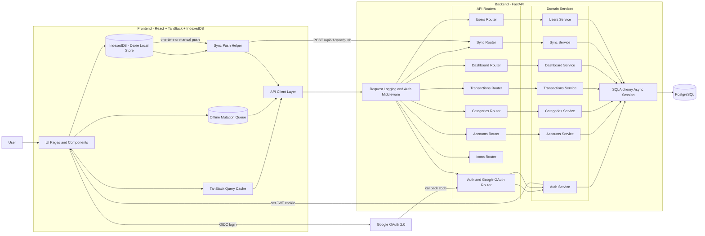

# Daily Budget Manager Architecture Diagram

## Notes

- Offline-first behavior is implemented through local IndexedDB storage and an offline mutation queue in the frontend.
- Cloud persistence is handled by the FastAPI backend with PostgreSQL.
- Google OAuth is used for sign-in, after which local data can be pushed through the sync endpoint.
- Current sync push is append-only/idempotent for existing IDs in backend documentation.
