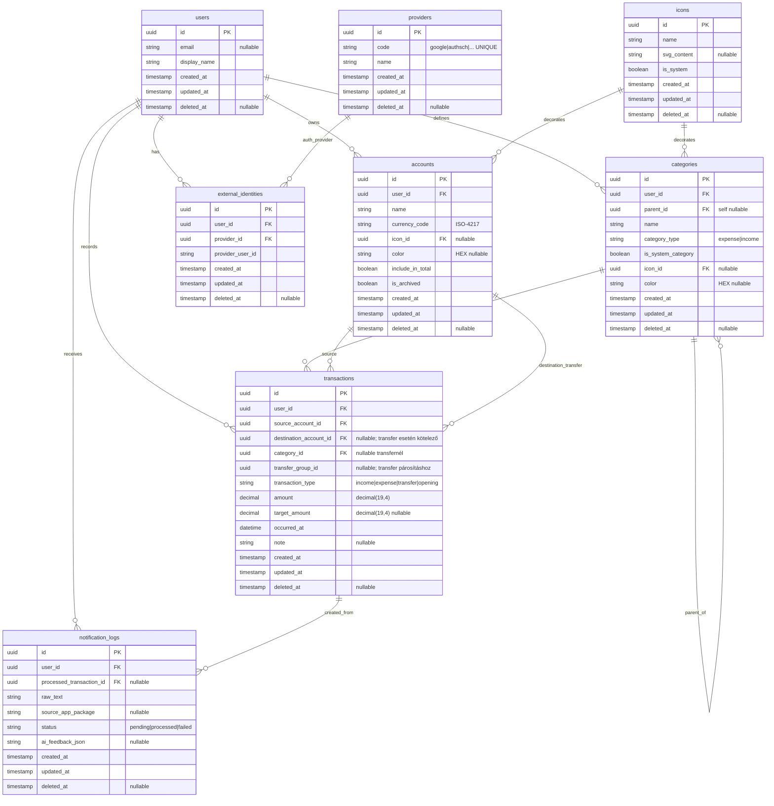

```mermaid
erDiagram
    users ||--o{ accounts : "owns"
    users ||--o{ categories : "defines"
    users ||--o{ transactions : "records"
    users ||--o{ external_identities : "has"
    users ||--o{ notification_logs : "receives"

    providers ||--o{ external_identities : "auth_provider"

    icons ||--o{ accounts : "decorates"
    icons ||--o{ categories : "decorates"

    categories ||--o{ categories : "parent_of"
    categories ||--o{ transactions : "categorizes"

    accounts ||--o{ transactions : "source"
    accounts ||--o{ transactions : "destination_transfer"
    transactions ||--o{ notification_logs : "created_from"

    users {
        uuid id PK
        string email "nullable"
        string display_name
        timestamp created_at
        timestamp updated_at
        timestamp deleted_at "nullable"
    }

    providers {
        uuid id PK
        string code "google|authsch|... UNIQUE"
        string name
        timestamp created_at
        timestamp updated_at
        timestamp deleted_at "nullable"
    }

    external_identities {
        uuid id PK
        uuid user_id FK
        uuid provider_id FK
        string provider_user_id
        timestamp created_at
        timestamp updated_at
        timestamp deleted_at "nullable"
    }

    icons {
        uuid id PK
        string name
        string svg_content "nullable"
        boolean is_system
        timestamp created_at
        timestamp updated_at
        timestamp deleted_at "nullable"
    }

    accounts {
        uuid id PK
        uuid user_id FK
        string name
        string currency_code "ISO-4217"
        uuid icon_id FK "nullable"
        string color "HEX nullable"
        boolean include_in_total
        boolean is_archived
        timestamp created_at
        timestamp updated_at
        timestamp deleted_at "nullable"
    }

    categories {
        uuid id PK
        uuid user_id FK
        uuid parent_id FK "self nullable"
        string name
        string category_type "expense|income"
        boolean is_system_category
        uuid icon_id FK "nullable"
        string color "HEX nullable"
        timestamp created_at
        timestamp updated_at
        timestamp deleted_at "nullable"
    }

    transactions {
        uuid id PK
        uuid user_id FK
        uuid source_account_id FK
        uuid destination_account_id FK "nullable; transfer esetén kötelező"
        uuid category_id FK "nullable transfernél"
        uuid transfer_group_id "nullable; transfer párosításhoz"
        string transaction_type "income|expense|transfer|opening"
        decimal amount "decimal(19,4)"
        decimal target_amount "decimal(19,4) nullable"
        datetime occurred_at
        string note "nullable"
        timestamp created_at
        timestamp updated_at
        timestamp deleted_at "nullable"
    }

    notification_logs {
        uuid id PK
        uuid user_id FK
        uuid processed_transaction_id FK "nullable"
        string raw_text
        string source_app_package "nullable"
        string status "pending|processed|failed"
        string ai_feedback_json "nullable"
        timestamp created_at
        timestamp updated_at
        timestamp deleted_at "nullable"
    }
```