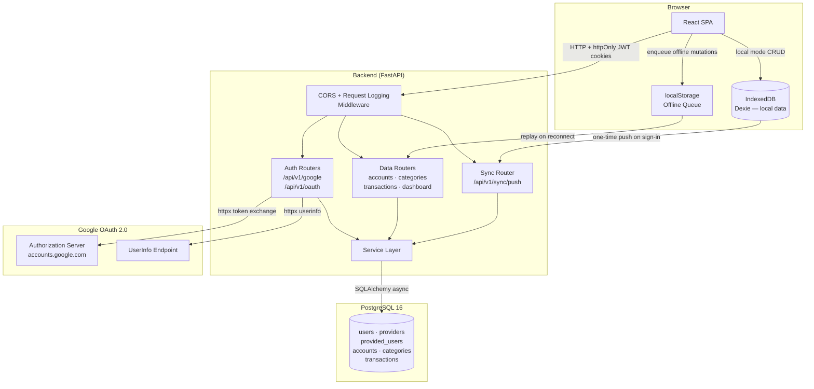

# Daily — Comprehensive Project Documentation

> **Version:** 1.0.0  
> **Last updated:** 2026-05-18
> **Author:** Marton Szenes

---

## Table of Contents

1. [Executive Project Overview](#1-executive-project-overview)
   - [1.1 High-Level Purpose](#11-high-level-purpose)
   - [1.2 System Architecture](#12-system-architecture)
   - [1.3 Core Technology Stack](#13-core-technology-stack)
2. [User Manual](#2-user-manual)
   - [2.1 Getting Started](#21-getting-started)
   - [2.2 Authentication & Access](#22-authentication--access)
   - [2.3 Dashboard](#23-dashboard)
   - [2.4 Accounts](#24-accounts)
   - [2.5 Categories](#25-categories)
   - [2.6 Transactions](#26-transactions)
   - [2.7 Settings](#27-settings)
   - [2.8 Troubleshooting FAQ](#28-troubleshooting-faq)
3. [Developer & Maintainer Manual](#3-developer--maintainer-manual)
   - [3.1 Local Development Setup](#31-local-development-setup)
   - [3.2 Backend Architecture Deep-Dive](#32-backend-architecture-deep-dive)
   - [3.3 Frontend Architecture Deep-Dive](#33-frontend-architecture-deep-dive)
   - [3.4 Deployment & DevOps Infrastructure](#34-deployment--devops-infrastructure)
4. [System Edge Cases & Known Technical Debt](#4-system-edge-cases--known-technical-debt)

---

## 1. Executive Project Overview

### 1.1 High-Level Purpose

**Daily** is a personal finance management application designed for individuals who want to track their income, expenses, and account balances across time. The central design philosophy is **offline-first**: the application is fully functional without any internet connection. Users can create a local profile, record transactions, and manage accounts entirely within their browser using IndexedDB (via Dexie). When the user later signs in with a Google account, all locally-stored data is transparently pushed to the backend for cloud persistence and multi-device continuity.

**Who it serves:**
- Individual users who want a lightweight, private personal budget tracker.
- Users in low-connectivity environments who require an app that does not depend on a server.
- Users who want cloud-backed sync across devices without giving up offline usability.

**Core capabilities:**
- Account management with multi-currency support
- Hierarchical category management (expense / income)
- Full transaction lifecycle (expense, income, internal transfer)
- Dashboard with balance trend chart, category breakdown, and summary tiles
- Offline queue that replays mutations when connectivity resumes
- One-time sync push from local browser storage to the authenticated backend

---

### 1.2 System Architecture



**Request flow summary:**

| Mode | Description |
|---|---|
| **Local (offline)** | The browser reads/writes directly to IndexedDB. No network required. All mutations are applied instantly in the browser. |
| **Online (authenticated)** | After Google sign-in, the frontend calls backend REST endpoints authenticated by httpOnly JWT cookies. |
| **Online but offline** | If the browser loses connectivity while the user is authenticated, mutations are serialised to localStorage. When the browser comes back online, the queue is replayed against the backend API automatically. |

---

### 1.3 Core Technology Stack

#### Backend

| Component | Library / Version | Role in Project |
|---|---|---|
| Language | Python 3.13 | Application runtime |
| Web framework | FastAPI 0.135 | REST API, routing, dependency injection |
| ORM | SQLAlchemy 2.0 (async) | Database access, model definitions, column properties |
| Async driver | asyncpg | Non-blocking PostgreSQL I/O |
| Sync driver | psycopg2 | Alembic migration runner + seed scripts |
| Database | PostgreSQL 16 | Persistent relational data store |
| Migrations | Alembic | Schema versioning and auto-upgrade on startup |
| Auth | PyJWT | JWT creation / verification for access and refresh tokens |
| OAuth client | httpx | Token exchange and userinfo fetching from Google |
| Validation | Pydantic v2 + pydantic-settings | Request/response schemas, typed env config |
| Logging | Loguru | Structured application logging, uvicorn interception |

#### Frontend

| Component | Library / Version | Role in Project |
|---|---|---|
| Language | TypeScript | Strongly-typed application code |
| UI framework | React 19 | Component rendering |
| Build tool | Vite | Dev server, production bundling |
| Routing | TanStack Router | File-based routing, type-safe navigation |
| Server state | TanStack Query | Data fetching, caching, invalidation |
| HTTP client | Axios | REST calls to backend, interceptor-based 401 refresh |
| UI library | MUI 7 (Material UI) | Component system, theming, icons |
| Local database | Dexie 4 (IndexedDB) | Offline-first local storage |
| Charts | Recharts 3 | Balance trend chart, category breakdown |
| API client | openapi-generator (typescript-axios) | Generated, typed API bindings from backend OpenAPI spec |
| Test runner | Vitest + Testing Library | Unit and component tests |
| Linter / Formatter | ESLint + Prettier | Code quality enforcement |

#### Infrastructure

| Component | Technology | Role |
|---|---|---|
| Containerisation | Docker + Docker Compose | Local full-stack orchestration |
| Database container | postgres:16-alpine | Isolated PostgreSQL instance |
| Frontend container | node:22-alpine | Serves Vite dev server |
| Backend container | python:3.13-slim | Serves uvicorn with hot-reload |

---

## 2. User Manual

### 2.1 Getting Started

Daily works in two modes, and you choose which on first visit.

**Local mode — no account required**

1. Open the app in your browser.
2. Click **Get started locally**.
3. Enter a display name and an email address. The email is your local identifier only — it is never sent to a server.
4. You are taken directly to the Dashboard. All your data is stored in your browser's IndexedDB database.

> **Important:** Local data lives in the browser you used to create it. Clearing browser storage, using a different browser, or switching devices will not carry your data over — unless you link a Google account first.

**Online mode — Google account**

1. Open the app.
2. Click **Login via Google**.
3. Complete the Google sign-in flow on Google's page.
4. You are redirected back to Daily's callback page, which verifies your session and then takes you to the Dashboard.

If you had local data before signing in with Google, Daily will automatically sync it to your account during the callback step.

---

### 2.2 Authentication & Access

#### Local Profile Creation

When you choose local mode, a profile record with `key: "local"` is written to the browser's IndexedDB. This profile persists across browser sessions until you explicitly log out. On every subsequent visit, Daily detects this record and automatically places you in local mode.

#### Google OAuth Sign-In Flow

1. The app redirects your browser to `GET /api/v1/google/login`.
2. The backend constructs a short-lived signed JWT as the OAuth **state** token (expires after the configured `jwt_login_token_expire_minutes` window) and redirects to Google's authorization endpoint.
3. Google presents its consent screen. The requested scopes are `openid profile email` with `access_type=offline`.
4. After you approve, Google redirects to the configured `redirect_uri` with an authorization `code` and the `state` token.
5. The backend's `GET /api/v1/oauth/callback` validates the `state` token, exchanges the `code` for an access token at Google's token endpoint, then calls Google's userinfo endpoint to retrieve your `sub`, email, display name, and avatar URL.
6. The backend performs a **find-or-create** on the `provided_users` table using the Google `sub`. If this is your first sign-in, a new `users` record and a `provided_users` record are created.
7. The backend issues two httpOnly cookies: `access_token` (short-lived, configured by `JWT_ACCESS_TOKEN_EXPIRE_MINUTES`) and `refresh_token` (long-lived, configured by `JWT_REFRESH_TOKEN_EXPIRE_DAYS`).
8. The browser is redirected to the frontend's `/callback` route, which calls `POST /api/v1/oauth/validate` to confirm the session.

#### Token Refresh

When any API call returns `401 Unauthorized`, the frontend's Axios response interceptor silently calls `POST /api/v1/oauth/refresh`. If the refresh token is still valid, the backend issues a new access token cookie and the original request is transparently retried. If the refresh also fails, the user is redirected to the login page (`/`).

#### Logout

- **Local mode:** Clicking logout in Settings calls `logoutLocal()`, which deletes the local profile from IndexedDB, clears the auth mode, and navigates to `/`.
- **Online mode:** Clicking logout calls `POST /api/v1/oauth/logout`, which deletes both the `access_token` and `refresh_token` cookies server-side, and then navigates to `/`.

---

### 2.3 Dashboard

The Dashboard is the first page you see after logging in. It gives you a financial snapshot at a glance.

**What you see:**

| Section | Description |
|---|---|
| **Balance Header** | Total net balance across all accounts that have `include_in_total` enabled. |
| **Balance Trend Chart** | A line chart of your net balance over time. You can switch between **Daily**, **Weekly**, **Monthly**, **Yearly**, or a **Custom date range**. |
| **Summary Tiles** | Total income and total expenses for the selected interval. |
| **Category Breakdown** | A breakdown of spending (or income) grouped by category for the selected interval. |
| **Recent Transactions** | The 10 most recent transactions across all accounts. |

> In local mode, the Dashboard is built from your IndexedDB data in the browser. In online mode, it is fetched from `GET /api/v1/dashboard`.

---

### 2.4 Accounts

Accounts represent your real-world money containers — bank accounts, wallets, savings pots, or credit cards.

#### Viewing Accounts

Navigate to **Accounts** via the bottom navigation bar. You see a list of all your active (non-archived) accounts. Each card shows the account name, currency, current balance, and icon.

> The balance shown is always **computed live** from all non-deleted transactions linked to that account. It is never stored as a static value.

#### Creating an Account

1. Tap the **+** button or navigate to `/accounts/new`.
2. Fill in the required fields:
   - **Name** — must be unique across your accounts (case-sensitive at the database level).
   - **Currency** — a 3-letter ISO 4217 currency code (e.g. `USD`, `HUF`, `EUR`).
   - **Icon** — choose a MUI icon name.
   - **Color** — a hex colour code (e.g. `#1976d2`).
   - **Include in total** — whether this account's balance is included in the Dashboard's net total.
3. Submit. The account is created immediately (locally in offline mode, or via `POST /api/v1/accounts` in online mode).

> **Opening balance:** To set an opening balance, create an income transaction dated to the account's start date after creating the account.

#### Editing an Account

Navigate to the account's detail page (`/accounts/:id`) and use the edit form. You can change the name, icon, colour, include-in-total flag, and archived status. Currency cannot be changed while transactions exist on the account (this is validated at the application layer).

#### Archiving an Account

Setting `is_archived = true` via the edit form hides the account from pickers and selectors throughout the app but preserves its full transaction history and keeps its balance contribution to statistics. Archived accounts are never physically deleted.

---

### 2.5 Categories

Categories organise your transactions. They form a two-level tree (parent → children) and are typed as either **expense** or **income**.

#### Viewing Categories

Navigate to **Categories** via the bottom navigation bar. You see a flat list of all your active categories.

The tree view is also available at `GET /api/v1/categories/tree` (API) or via the `useCategories` hook which the UI consumes as a flat list and assembles into a tree on the client with `categoryTree.ts`.

#### Creating a Category

1. Tap the **+** button or navigate to `/categories/new`.
2. Fill in:
   - **Name** — must be non-empty; unique within the same parent / type / user combination.
   - **Type** — `expense` or `income`.
   - **Parent** — optionally select an existing category of the same type as the parent.
   - **Icon** and **Color** — display customisation.
3. Submit.

> A category cannot be its own parent. This is enforced by a database `CHECK` constraint (`ck_categories_parent_not_self`).

#### Editing a Category

Navigate to `/categories/:id`. You can change the name, parent, icon, colour, and type. Moving a category to a different parent is permitted as long as it does not create a cycle (the database constraint prevents self-reference; the app enforces no deeper cycle check beyond that at this time).

#### Deleting a Category

Deleting a category is a **soft delete** — `deleted_at` is set on the record. Transactions linked to a deleted category retain their `category_id` FK (set to `NULL` via `ON DELETE SET NULL`), so historical data is preserved.

> Before deleting a category that has active transactions, consider reassigning those transactions to another category to avoid `null` category references.

---

### 2.6 Transactions

Transactions are the core records of your financial activity.

#### Transaction Types

| Type | Required fields | Account fields |
|---|---|---|
| **Expense** | `amount`, `category_id`, `source_account_id`, `occurred_at` | Money flows **out of** the source account. |
| **Income** | `amount`, `category_id`, `destination_account_id`, `occurred_at` | Money flows **into** the destination account. |
| **Transfer** | `amount`, `source_account_id`, `destination_account_id`, `occurred_at` | No category. If the accounts have different currencies, `target_amount` must be provided (the credited amount in the destination account's currency). |

#### Viewing Transactions

Navigate to **Transactions** (the `+` FAB in the middle of the bottom navigation opens the New Transaction page; the Transactions list is accessible from the nav item). The list supports filtering by:

- Date range (`date_from`, `date_to`)
- Category
- Account
- Transaction type

Pagination is controlled by `skip` and `limit` query parameters (default: skip=0, limit=100, max limit=1000). The total record count is returned in the `total` field of the response.

#### Creating a Transaction

1. Navigate to `/transactions/new` or tap the **+** FAB.
2. Select the transaction type.
3. For **expense**: choose a source account, a category, enter the amount, and optionally a date and note.
4. For **income**: choose a destination account, a category, enter the amount, and optionally a date and note.
5. For **transfer**: choose a source and a destination account (they must be different), enter the debit amount, and if the currencies differ, also enter the credited target amount.
6. Submit.

#### Editing a Transaction

Navigate to `/transactions/:id`. Any field can be changed. After save, the relevant account balances are recalculated automatically on the next read (because balance is a computed column, not a stored value).

#### Deleting a Transaction

Deletion is always a **soft delete**: `deleted_at` is set and the transaction is excluded from all balance and dashboard calculations. The record itself remains in the database for audit/history purposes.

---

### 2.7 Settings

The Settings page (`/settings`) provides account and application controls.

| Section | What it does |
|---|---|
| **Profile** | Displays your current auth mode (local or online) and your name. |
| **Link Google Account** | Visible in local mode. Tapping this redirects to Google OAuth, exactly as the main login flow. On return, your local IndexedDB data is pushed to the backend and local storage is cleared. |
| **Manual Sync** | Visible in online mode when local data still exists. Initiates `POST /api/v1/sync/push` manually and clears local storage on success. |
| **Theme** | Toggle between Light and Dark mode. Preference is persisted to `localStorage` under the key `daily-theme-mode`. The app also respects the OS `prefers-color-scheme` media query if no preference is stored. |
| **Logout** | Ends the session (local or online) and returns to the login page. |

---

### 2.8 Troubleshooting FAQ

**Q: My data disappeared after I cleared browser storage.**  
A: In local mode, all data lives in your browser's IndexedDB. If you clear site data or use a private browsing window, that data is not available. To prevent this, link your Google account via Settings before clearing data.

**Q: I get "Login could not be completed" on the callback page.**  
A: The most common cause is an expired or invalid OAuth state token. The state token is a short-lived JWT that expires within the configured `jwt_login_token_expire_minutes` window. Start the login flow again from the home page.

**Q: My session expired while I was using the app.**  
A: The app automatically attempts a silent token refresh when a request returns `401`. If the refresh token has also expired, you will be redirected to the login page. Simply sign in again — your cloud data is preserved.

**Q: I made changes while offline but they did not appear after I reconnected.**  
A: Changes made while offline in authenticated mode are queued in `localStorage` under the key `daily_offline_queue`. They are replayed automatically when the browser detects the `online` event. A success notification is shown after replay. If some mutations failed, they remain in the queue for the next reconnect attempt.

**Q: Why is my account balance different from what I expect?**  
A: Balance is always computed from transaction rows — it is not stored as a static field. If a transaction was soft-deleted (`deleted_at` set), it is excluded. If you have a transfer with `target_amount`, that value (not `amount`) is credited to the destination account.

**Q: Can I use the app on multiple browsers or devices without a Google account?**  
A: No. Local mode is scoped to a single browser's IndexedDB. For multi-device use, sign in with Google so your data is persisted in the cloud backend.

---

## 3. Developer & Maintainer Manual

### 3.1 Local Development Setup

#### Prerequisites

| Tool | Minimum Version | Notes |
|---|---|---|
| Python | 3.13 | Backend runtime |
| Node.js | 22 | Frontend dev server and build |
| npm | 10+ | Frontend package manager |
| Docker Desktop | Any recent | Recommended for full-stack local run |
| PostgreSQL | 16 | Only needed for manual (non-Docker) setup |

#### Environment Variables

Create a `.env` file in the repository root (next to `docker-compose.yml`). The backend reads it via `pydantic-settings` with a `../.env` path relative to the `backend/` directory.

```dotenv
# ─── Application ──────────────────────────────────────────────────
log_level=INFO
environment=development     # 'development' or 'production'

# ─── Database (db_ prefix) ────────────────────────────────────────
db_host=localhost           # Use 'db' when running in Docker Compose
db_port=5432
db_username=postgres
db_password=your_password
db_name=daily

# ─── JWT (jwt_ prefix) ────────────────────────────────────────────
jwt_secret_key=your_very_long_random_secret_key
jwt_algorithm=HS256
jwt_access_token_expire_minutes=30
jwt_refresh_token_expire_days=30
jwt_login_token_expire_minutes=10

# ─── Google OAuth (google_ prefix) ────────────────────────────────
google_client_id=your_google_client_id.apps.googleusercontent.com
google_client_secret=your_google_client_secret
google_redirect_uri=http://localhost:8000/api/v1/oauth/callback
google_token_url=https://oauth2.googleapis.com/token
google_userinfo_url=https://www.googleapis.com/oauth2/v3/userinfo

# ─── Frontend (frontend_ prefix) ──────────────────────────────────
frontend_auth_callback=http://localhost:3000/callback
frontend_cors_origins=http://localhost:3000

# ─── Docker port mapping (optional overrides) ────────────────────
db_port_exposed=5432
backend_port=8000
```

> **Security:** Never commit real secrets to version control. Use environment variable injection at the runtime boundary (Docker secrets, CI secret stores, or a secrets manager).

#### Option A — Full Stack with Docker Compose (recommended)

```bash
docker compose up --build
```

This starts three services:
- `daily-db` — PostgreSQL 16, health-checked before the backend starts.
- `daily-backend` — FastAPI with `--reload`, hot-reloading from `./backend/app` and `./backend/db`.
- `daily-frontend` — Vite dev server on port 3000.

The backend service overrides `db_host=db` via the `environment` block in `docker-compose.yml` so that it resolves to the `db` container, not `localhost`.

#### Option B — Backend Only (manual Python)

```bash
cd backend
pip install -r requirements.txt
alembic upgrade head
uvicorn app.main:app --host 0.0.0.0 --port 8000 --reload
```

Alembic automatically creates the configured database if it does not exist (via `ensure_database_exists()` in `db/core.py`), then runs all pending migrations.

#### Option C — Frontend Only (manual Node)

```bash
cd frontend
npm install
npm run start        # Vite dev server on port 3000
```

The frontend reads the API base URL from the runtime-injected `window.__ENV__.VITE_API_BASE_URL`, falling back to `import.meta.env.VITE_API_BASE_URL` (build-time) and then `window.location.origin` as a last resort.

#### Running Tests

**Backend:**
```bash
cd backend
pytest
```

Tests use `conftest.py` at the root of the backend directory, which sets up an in-process test database and a `TestClient` with dependency overrides.

**Frontend:**
```bash
cd frontend
npm run test       # vitest run (single pass)
```

#### Regenerating the API Client

When backend endpoints change, regenerate the TypeScript API client:

```bash
cd frontend
npm run gen-api
```

This calls `openapi-generator-cli` against `http://localhost:8000/openapi.json` and writes the generated client to `src/api/generated/`. Commit the regenerated files.

---

### 3.2 Backend Architecture Deep-Dive

#### Directory Structure

```
backend/
├── alembic.ini                   # Alembic config — points to db/migrations/
├── conftest.py                   # Shared pytest fixtures
├── requirements.txt
├── Dockerfile
│
├── app/
│   ├── main.py                   # FastAPI app, lifespan, CORS, request logging middleware
│   ├── routers.py                # Central router — all /api/v1/* prefixes registered here
│   │
│   ├── core/
│   │   ├── config.py             # pydantic-settings: AppConfig, Database, JWT, Google, Frontend
│   │   └── logging.py            # Loguru config + uvicorn log interception
│   │
│   ├── auth/
│   │   ├── schema.py             # TokenData, TokenType, FlowType, AuthMethod, ResponseMessage
│   │   ├── jwt_utils.py          # Token creation/decoding, get_current_user dependency
│   │   ├── oauth_router.py       # /oauth/logout, /validate, /refresh, /token, /callback
│   │   └── google/
│   │       └── google_router.py  # GET /google/login — builds redirect URL
│   │
│   ├── accounts/                 # Accounts CRUD
│   ├── categories/               # Categories CRUD + tree builder
│   ├── transactions/             # Transactions CRUD + filtered list
│   ├── dashboard/                # Dashboard aggregation
│   ├── sync/                     # One-time sync push
│   └── users/                    # User and provider CRUD (internal)
│
└── db/
    ├── core.py                   # Async engine, session factory, DB auto-create
    ├── models.py                 # All SQLAlchemy ORM models + balance column_property
    └── migrations/
        ├── env.py                # Alembic environment — uses sync engine from core.py
        └── versions/             # Migration scripts
```

#### Application Startup

On startup, the FastAPI `lifespan` context manager:
1. Calls `configure_logging()` — sets up Loguru and intercepts uvicorn's standard logging.
2. Calls `_run_migrations()` — runs `alembic upgrade head` via Python API. If the database does not exist yet (`OperationalError` matching the missing DB pattern), it calls `ensure_database_exists()` which connects to the `postgres` administrative database and issues `CREATE DATABASE`. The migration is then re-run.
3. Logs `"Application startup complete."` and yields control.

#### Middleware Stack

Applied in order (outermost first):

| Middleware | Effect |
|---|---|
| `CORSMiddleware` | Allows requests from `frontend_cors_origins`. `allow_credentials=True` is required for cookie-based auth. |
| `request_logging_middleware` | Logs every HTTP request with method, path, status code, and elapsed milliseconds to Loguru. |
| `unhandled_exception_handler` | Catches any unhandled exceptions and returns a `500 {"detail": "Internal server error"}` JSON response, ensuring CORS headers are present even on crashes. |

#### API Specifications

All endpoints are prefixed with `/api/v1/`. Authentication is via httpOnly cookie (`access_token`). Protected routes use the `get_current_user` FastAPI dependency.

---

##### Auth — Google Login

| Method | Path | Auth | Description |
|---|---|---|---|
| `GET` | `/api/v1/google/login` | None | Builds a signed state JWT and redirects to `https://accounts.google.com/o/oauth2/v2/auth` with `scope=openid profile email`. |

---

##### Auth — OAuth

| Method | Path | Auth | Description |
|---|---|---|---|
| `GET` | `/api/v1/oauth/callback` | None (cookies are set here) | Exchanges authorization code for Google tokens, fetches userinfo, find-or-creates the backend user, sets `access_token` and `refresh_token` cookies, and redirects to `frontend_auth_callback`. |
| `POST` | `/api/v1/oauth/validate` | `access_token` cookie | Decodes the access token, verifies the user exists in DB. Returns `{"message": "Access token is valid"}` or `401`. |
| `POST` | `/api/v1/oauth/refresh` | `refresh_token` cookie | Issues a new `access_token` cookie from a valid refresh token. |
| `POST` | `/api/v1/oauth/logout` | None | Deletes `access_token` and `refresh_token` cookies. |
| `GET` | `/api/v1/oauth/token` | `access_token` cookie | Returns the raw access token string (for API clients that cannot read cookies). |

Cookie security policy:

```python
{
    "httponly": True,
    "secure": True,        # only in production (environment == 'production')
    "samesite": "lax",
    "path": "/",
}
```

---

##### Accounts

All endpoints require `access_token` cookie.

| Method | Path | Request Body | Response | Description |
|---|---|---|---|---|
| `GET` | `/api/v1/accounts` | — | `list[AccountIndex]` | All non-deleted accounts for the current user. |
| `GET` | `/api/v1/accounts/{account_id}` | — | `AccountIndex` | Single account. Returns `404` if not found or not owned by the user. |
| `POST` | `/api/v1/accounts` | `CreateAccount` | `201 No Content` | Creates a new account. Returns `400` on duplicate name (`IntegrityError`). |
| `PATCH` | `/api/v1/accounts/{account_id}` | `UpdateAccount` | `AccountIndex` | Partial update — only provided fields are changed. |
| `DELETE` | `/api/v1/accounts/{account_id}` | — | `204 No Content` | Soft-deletes the account (sets `deleted_at`). |

**`CreateAccount` schema:**

```json
{
  "name": "string (required)",
  "currency_code": "string, 3-letter ISO 4217 (required)",
  "icon_name": "string (required)",
  "color": "string, hex #RRGGBB (required)",
  "include_in_total": "boolean (required)",
  "balance": "decimal (optional, not yet persisted as a transaction)"
}
```

**`AccountIndex` response schema:**

```json
{
  "id": "uuid",
  "name": "string",
  "balance": "decimal (computed from transactions)",
  "currency_code": "string",
  "icon_name": "string",
  "color": "string",
  "include_in_total": "boolean",
  "is_archived": "boolean"
}
```

---

##### Categories

All endpoints require `access_token` cookie.

| Method | Path | Request Body | Response | Description |
|---|---|---|---|---|
| `GET` | `/api/v1/categories` | — | `list[CategoryIndex]` | All non-deleted categories for the user. |
| `GET` | `/api/v1/categories/tree` | — | `list[CategoryTree]` | Categories assembled as a recursive tree (root nodes with nested `children`). |
| `GET` | `/api/v1/categories/{category_id}` | — | `CategoryIndex` | Single category. Returns `404` if not found. |
| `POST` | `/api/v1/categories` | `CreateCategory` | `201 No Content` | Creates a new category. |
| `PATCH` | `/api/v1/categories/{category_id}` | `UpdateCategory` | `CategoryIndex` | Partial update. |
| `DELETE` | `/api/v1/categories/{category_id}` | — | `204 No Content` | Soft-deletes the category. |

**`CreateCategory` schema:**

```json
{
  "name": "string (required)",
  "type": "expense | income (required)",
  "parent_id": "uuid (optional)",
  "icon_name": "string (required)",
  "color": "string, hex #RRGGBB (optional)"
}
```

---

##### Transactions

All endpoints require `access_token` cookie.

| Method | Path | Query Params | Request Body | Response | Description |
|---|---|---|---|---|---|
| `GET` | `/api/v1/transactions` | `date_from`, `date_to`, `category_id`, `account_id`, `transaction_type`, `skip`, `limit` | — | `TransactionListResponse` | Filtered, paginated list. |
| `GET` | `/api/v1/transactions/{transaction_id}` | — | — | `TransactionIndex` | Single transaction. |
| `POST` | `/api/v1/transactions` | — | `CreateTransaction` | `201 No Content` | Creates a new transaction. Validates type-specific field requirements at the router layer before persisting. |
| `PATCH` | `/api/v1/transactions/{transaction_id}` | — | `UpdateTransaction` | `TransactionIndex` | Partial update. |
| `DELETE` | `/api/v1/transactions/{transaction_id}` | — | — | `204 No Content` | Soft-deletes the transaction. |

**`TransactionListResponse` schema:**

```json
{
  "data": "list[TransactionIndex]",
  "total": "integer (total matching rows before pagination)",
  "skip": "integer",
  "limit": "integer"
}
```

**`CreateTransaction` schema:**

```json
{
  "amount": "decimal > 0 (required)",
  "transaction_type": "expense | income | transfer (required)",
  "occurred_at": "datetime ISO 8601 (required)",
  "category_id": "uuid (required for expense/income, null for transfer)",
  "source_account_id": "uuid (required for expense/transfer, null for income)",
  "destination_account_id": "uuid (required for income/transfer, null for expense)",
  "target_amount": "decimal (required for cross-currency transfer)",
  "note": "string (optional)"
}
```

---

##### Dashboard

| Method | Path | Auth | Response | Description |
|---|---|---|---|---|
| `GET` | `/api/v1/dashboard` | `access_token` cookie | `DashboardIndex` | Returns all account briefs and the 10 most recent transactions for the user. |

**`DashboardIndex` schema:**

```json
{
  "accounts": "list[AccountBrief]",
  "transactions": "list[TransactionBrief]"
}
```

---

##### Sync

| Method | Path | Auth | Request Body | Response | Description |
|---|---|---|---|---|---|
| `POST` | `/api/v1/sync/push` | `access_token` cookie | `SyncPushRequest` | `SyncPushResponse` | One-time bulk upload. Idempotent — rows whose `id` already exists are silently skipped. |

**`SyncPushRequest` schema:**

```json
{
  "accounts": "list[SyncAccount]",
  "categories": "list[SyncCategory]",
  "transactions": "list[SyncTransaction]"
}
```

**`SyncPushResponse` schema:**

```json
{
  "accounts_created": "integer",
  "categories_created": "integer",
  "transactions_created": "integer",
  "message": "string"
}
```

Insertion order within the transaction: accounts → categories → transactions (respects FK dependencies).

---

##### Health

| Method | Path | Auth | Response |
|---|---|---|---|
| `GET` | `/` | None | `{"msg": "Hello World"}` |
| `GET` | `/health` | None | `{"status": "ok"}` |

---

#### Database Schema & Constraints

All tables inherit `created_at`, `updated_at` (auto-maintained via `server_default` and `onupdate`), and `deleted_at` (nullable, used for soft deletes) from the `Base` declarative class.

##### `users`

| Column | Type | Constraints |
|---|---|---|
| `id` | UUID PK | `default=uuid4` |
| `email` | VARCHAR(255) | Nullable; unique partial index where `email IS NOT NULL AND deleted_at IS NULL` |
| `display_name` | VARCHAR(255) | `CHECK length(trim(display_name)) > 0` |
| `avatar_url` | TEXT | Nullable |

##### `providers`

| Column | Type | Constraints |
|---|---|---|
| `id` | UUID PK | |
| `name` | VARCHAR(255) | Unique partial index where `deleted_at IS NULL`; `CHECK length(trim(name)) > 0` |
| `is_enabled` | BOOLEAN | `server_default=true` |

##### `provided_users`

| Column | Type | Constraints |
|---|---|---|
| `id` | UUID PK | |
| `user_id` | UUID FK → `users.id` | `ON DELETE CASCADE` |
| `provider_id` | UUID FK → `providers.id` | `ON DELETE RESTRICT` |
| `provider_user_id` | VARCHAR(255) | Composite unique partial index on `(provider_id, provider_user_id)` where `deleted_at IS NULL` |

##### `accounts`

| Column | Type | Constraints |
|---|---|---|
| `id` | UUID PK | |
| `user_id` | UUID FK → `users.id` | `ON DELETE CASCADE` |
| `name` | VARCHAR(255) | Unique partial index on `(user_id, name)` where `deleted_at IS NULL`; `CHECK length(trim(name)) > 0` |
| `currency_code` | VARCHAR(3) | `CHECK currency_code ~ '^[A-Z]{3}$'` |
| `icon_name` | VARCHAR(100) | `server_default='Savings'` |
| `color` | VARCHAR(7) | `CHECK color ~ '^#[0-9A-Fa-f]{6}$'` or NULL |
| `include_in_total` | BOOLEAN | `server_default=true` |
| `is_archived` | BOOLEAN | `server_default=false` |
| `balance` | DECIMAL (computed) | `column_property` — a correlated scalar subquery that sums transaction credits minus debits for this account, excluding soft-deleted rows |

The `balance` column property is computed at the SQL level using:
- `coalesce(target_amount, amount)` for incoming transfers (credits the `target_amount` if present, otherwise `amount`)
- `-amount` for outgoing transfers and expenses
- `amount` for income

##### `categories`

| Column | Type | Constraints |
|---|---|---|
| `id` | UUID PK | |
| `user_id` | UUID FK → `users.id` | `ON DELETE CASCADE` |
| `parent_id` | UUID FK → `categories.id` | `ON DELETE SET NULL`; `CHECK parent_id <> id` (no self-reference) |
| `name` | VARCHAR(255) | Unique on `(user_id, parent_id, name, category_type)` where active; `CHECK length(trim(name)) > 0` |
| `category_type` | VARCHAR(20) | `CHECK category_type IN ('expense', 'income')` |
| `is_system_category` | BOOLEAN | `server_default=false` |
| `icon_name` | VARCHAR(100) | `server_default='Savings'` |
| `color` | VARCHAR(7) | `CHECK color ~ '^#[0-9A-Fa-f]{6}$'` or NULL |

##### `transactions`

| Column | Type | Constraints |
|---|---|---|
| `id` | UUID PK | |
| `user_id` | UUID FK → `users.id` | `ON DELETE CASCADE` |
| `source_account_id` | UUID FK → `accounts.id` | Nullable; `ON DELETE RESTRICT` |
| `destination_account_id` | UUID FK → `accounts.id` | Nullable; `ON DELETE SET NULL` |
| `category_id` | UUID FK → `categories.id` | Nullable; `ON DELETE SET NULL` |
| `transaction_type` | VARCHAR(20) | `CHECK transaction_type IN ('income', 'expense', 'transfer', 'overwrite')` |
| `amount` | NUMERIC(18,4) | `CHECK amount > 0` |
| `target_amount` | NUMERIC(18,4) | Nullable; used for cross-currency transfers |
| `occurred_at` | DATETIME(tz) | Not null |
| `note` | TEXT | Nullable |

The most complex constraint is `ck_transactions_type_integrity`, a composite `CHECK` that enforces:
- **income**: `destination_account_id NOT NULL`, `source_account_id IS NULL`, `category_id NOT NULL`
- **expense**: `source_account_id NOT NULL`, `destination_account_id IS NULL`, `category_id NOT NULL`
- **transfer**: `source_account_id NOT NULL`, `destination_account_id NOT NULL`, `source_account_id <> destination_account_id`, `category_id IS NULL`, `target_amount NOT NULL`

Indexes are defined on the most common query patterns:
- `(user_id, occurred_at, deleted_at)` — main timeline queries
- `(source_account_id, occurred_at)` and `(destination_account_id, occurred_at)` — per-account balance queries
- `(user_id, transaction_type, occurred_at, deleted_at)` — type-filtered timeline

#### Connection Pool Configuration

The async SQLAlchemy engine is configured with:
```python
pool_size=20
max_overflow=30
pool_pre_ping=True
```

This supports up to 50 simultaneous database connections (`pool_size + max_overflow`). `pool_pre_ping=True` discards stale connections before use.

---

### 3.3 Frontend Architecture Deep-Dive

#### Directory Structure

```
frontend/src/
├── constants.ts                  # APP_NAME, API_BASE URL resolution
├── main.tsx                      # Root render: QueryClientProvider + RouterProvider
├── router.tsx                    # TanStack Router creation from generated route tree
├── routeTree.gen.ts              # Auto-generated by TanStack Router plugin
│
├── api/
│   ├── authClient.ts             # Separate axios instance (no interceptor) for auth calls
│   ├── clients.ts                # Shared axios instance + generated API class instances
│   ├── notificationService.ts    # Singleton notification bus (toast dispatcher)
│   ├── queryClient.ts            # TanStack Query client (staleTime, retry config)
│   ├── queryKeys.ts              # Canonical query key factory
│   ├── responseHandler.ts        # Axios interceptor: 401 refresh, error toasts
│   └── generated/                # Auto-generated TypeScript-Axios client
│
├── features/
│   ├── accounts/                 # AccountsPage, CreateAccountPage, EditAccountPage
│   │   ├── hooks/useAccounts.ts  # Dual-mode queries + mutations
│   │   └── components/           # AccountCard, AccountForm, etc.
│   ├── auth/
│   │   ├── hooks/useLocalAuth.tsx # LocalAuthProvider + useLocalAuth hook
│   │   ├── hooks/useAuthVerification.ts
│   │   └── components/AuthGuard.tsx
│   ├── categories/               # CategoriesPage, tree building, Create/EditCategoryPage
│   ├── dashboard/                # DashboardPage + BalanceTrendChart, SummaryTiles, etc.
│   ├── settings/                 # SettingsPage (logout, theme, sync)
│   └── transactions/             # TransactionsPage, NewTransactionPage, EditTransactionPage
│
├── lib/
│   ├── localDb.ts                # Dexie database class + table interface types
│   ├── localCrud.ts              # CRUD functions for all local tables + balance helpers
│   ├── offlineQueue.ts           # Mutation queue (localStorage) + replay logic
│   └── syncPush.ts               # hasLocalData() + syncPushToBackend()
│
├── routes/                       # TanStack Router file-based route definitions
│   ├── __root.tsx                # Root layout, providers, interceptor init, offline sync
│   ├── index.tsx                 # Login page (/)
│   ├── register.tsx              # Local registration (/register)
│   ├── callback.tsx              # OAuth callback handler (/callback)
│   ├── dashboard.tsx
│   ├── settings.tsx
│   ├── accounts/[index|new|$id].tsx
│   ├── categories/[index|new|$id].tsx
│   └── transactions/[index|new|$id].tsx
│
├── shared/
│   ├── layout/                   # PageLayout, BottomNav, NotFoundPage, DemoPage
│   ├── providers/SnackbarProvider.tsx
│   ├── ThemeModeToggle.tsx
│   └── ui/                       # EmptyState, NavButton, PageHeader, HealthIcon
│
└── theme/
    ├── theme.ts                  # MUI theme definitions (light + dark)
    └── themeMode.tsx             # ThemeModeProvider + useThemeMode hook
```

#### State and API Client Architecture

**Dual-mode hook pattern:**

Every domain hook (`useAccounts`, `useCategories`, `useTransactions`, `useDashboard`) reads the current auth mode from `useLocalAuth()` and branches its `queryFn` accordingly:

```typescript
// Online mode → backend API
() => accountsApi.getMyAccountsApiV1AccountsGet().then(r => r.data)

// Local mode → IndexedDB
() => getLocalAccounts().then(list => list.map(toAccountIndex))
```

Mutations follow the same pattern and additionally handle the third state (online mode + offline):

```typescript
if (isLocal || (mode === 'online' && isOffline())) {
  // Write to IndexedDB
  // If online, also enqueue for replay
} else {
  // Call backend API
}
```

**Query key structure** (`queryKeys.ts`):

```typescript
{
  dashboard: ['dashboard'],
  accounts: {
    all: ['accounts'],
    detail: (id) => ['accounts', id],
  },
  categories: { ... },
  transactions: { ... },
}
```

All mutations call `queryClient.invalidateQueries` after success to trigger refetches of the relevant queries.

**Axios interceptor** (`responseHandler.ts`):

Attached once in the root route's `useEffect`. It intercepts all responses from `apiClient` (the shared Axios instance):
1. On `401`: marks the request `_retry=true` and calls `POST /api/v1/oauth/refresh` on a **separate** Axios instance (`authClient.ts` — without the interceptor, to avoid infinite loops). If successful, replays the original request. If the refresh also fails, calls `onUnauthenticated()` (a navigate-to-`/` callback) and shows an error toast.
2. On `403`: shows "access denied" toast.
3. On other `4xx` / `5xx`: extracts the `detail` field (string) or the first `msg` from a FastAPI `422` validation array, and shows an error toast.
4. Cancelled requests (route changes / query stale) are silently ignored via `axios.isAxiosError && error.code === 'ERR_CANCELED'`.

#### Auth Guard

`AuthGuard` wraps all routed content. Its logic:

```
pathname in PUBLIC_PATHS (/,  /callback, /register)?
  → render children immediately

mode === 'local'?
  → render children (no server check)

mode === 'undetermined'?
  → show spinner (waiting for IndexedDB profile check)

mode === 'online' and status === 'pending'?
  → show spinner (waiting for /validate call)

status === 'unauthenticated'?
  → render null (redirect already initiated by useAuthVerification)

else → render children
```

#### Offline Queue

`offlineQueue.ts` serialises mutations as JSON to `localStorage['daily_offline_queue']`. Each entry is a `QueueEntry` with a UUID, an ISO timestamp, and the mutation payload.

The `setupOfflineSync()` function (called once from the root route) attaches a `window.addEventListener('online', ...)` listener. When the browser comes online, it calls `replayQueue()`, which iterates the queue and dispatches each mutation to the appropriate API endpoint. Successfully replayed entries are removed; failed entries remain in the queue for the next reconnect. The on-success callback invalidates all TanStack Query caches and shows a toast.

#### Theme

`ThemeModeProvider` persists the selected theme to `localStorage['daily-theme-mode']` and reads `prefers-color-scheme` as the fallback when no preference is stored. Programmatic dark mode is applied by toggling the `dark` class on `document.documentElement` and setting `document.documentElement.style.colorScheme`.

---

### 3.4 Deployment & DevOps Infrastructure

#### Docker Compose (Development)

```yaml
services:
  db:        # postgres:16-alpine with health check
  backend:   # python:3.13-slim, uvicorn --reload, hot-reload via 'develop.watch'
  frontend:  # node:22-alpine, 'npm run start' (Vite dev server)
```

The `develop.watch` block in the backend service uses Docker Compose Watch to sync `./backend/app` and `./backend/db` into the container without a full rebuild.

#### Production Build

**Frontend:**
```bash
cd frontend
npm run build      # Outputs to dist/
```

Vite produces a tree-shaken, code-split bundle. For production, set `VITE_API_BASE_URL` as a build-time env variable or inject it at runtime via `public/env.js` (which populates `window.__ENV__`).

**Backend:**

The backend Dockerfile is single-stage (`python:3.13-slim`). For production, run:
```bash
uvicorn app.main:app --host 0.0.0.0 --port 8000 --workers 4
```

Remove `--reload` and set `environment=production` in the env file to enable `secure=True` on cookies.

#### Database Migrations

Migrations are managed by Alembic. The migration history lives in `backend/db/migrations/versions/`.

```bash
# Apply all pending migrations
alembic upgrade head

# Create a new migration (auto-generate from model diff)
alembic revision --autogenerate -m "description"

# Roll back one migration
alembic downgrade -1
```

The backend applies migrations automatically on every startup via `_run_migrations()`. In production, you may prefer to run `alembic upgrade head` as a pre-deploy step rather than on every process start.

#### Seed Data

`backend/db/seed/default_seed.py` can be run standalone to populate the database with default provider records (`google`) and system categories. Run it with the sync session factory from `db/core.py`.

---

## 4. System Edge Cases & Known Technical Debt

### Sync Conflict Resolution

The current sync push (`POST /api/v1/sync/push`) is append-only and idempotent: records whose `id` already exists are silently skipped. There is no conflict resolution for records that may have been modified both locally and on the server since the last sync. The winning record is always the server-side version, as the local record is not pushed if its `id` is already present.

**Impact:** If a user edits a transaction locally after previously having synced it, the local edit will not be propagated by a second push.

**Mitigation planned:** A pull-sync endpoint and `updated_at`-based conflict resolution (the spec's "last write wins" rule) are listed as future improvements in `local-user-plan.md`.

### Offline Queue Replay Failures

Failed mutations remain in the queue after a replay pass but there is no back-off policy, retry limit, or conflict telemetry. If a mutation permanently fails (e.g., the referenced account was deleted server-side), it will block the queue indefinitely.

**Impact:** Stale or invalid mutations accumulate in `localStorage` and are retried on every reconnect event.

**Mitigation planned:** A retry count and maximum-attempts limit with user-facing conflict reporting are identified as pending work in `plan.md`.

### Opening Balance Transactions

The `CreateAccount` schema includes an optional `balance` field, but the router currently does not create a corresponding income transaction when a non-zero opening balance is provided. The field is accepted and silently ignored.

**Impact:** Users who expect to set an opening balance at account creation will not have it reflected in the computed balance.

**Workaround:** Create a manual income transaction dated to the account's opening date.

### `overwrite` Transaction Type

The database `CHECK` constraint permits `transaction_type = 'overwrite'`, but no API endpoint, schema, or service layer code uses this type. It is reserved for a future balance-correction feature.

### Cookie Security in Development

Cookies are set with `secure=False` when `environment != 'production'`. This is intentional for local HTTP development but must not be deployed as-is. Set `environment=production` in all production deployments to enforce `Secure` on cookies.

### No Rate Limiting

There are no rate limits on any API endpoint, including the OAuth callback and token refresh endpoints. A production deployment should place a reverse proxy (e.g., nginx, Caddy, or a cloud API gateway) in front of the backend with per-IP rate limiting on auth endpoints.

### Category Cycle Detection

The database enforces `parent_id <> id` (no direct self-reference), but does not detect multi-level cycles (e.g., A → B → A). The service layer does not perform cycle detection before updating a category's `parent_id`. Moving a category to a descendant of itself would create an inconsistent tree.

### Balance Computed Column Performance

The `balance` field on `Accounts` is a SQLAlchemy `column_property` backed by a correlated scalar subquery. This subquery executes once per account row returned in a query. For users with many transactions, this can be slow at scale. A future optimisation would be to cache balances in a materialized view or a separate table updated by triggers.

### Frontend Bundle Splitting

The frontend is not configured with manual chunk splitting. On large datasets or as the codebase grows, the initial bundle size may increase. The `vite.config.ts` does not currently define `rollupOptions.output.manualChunks`.

### Missing Backend-Side Pagination for Accounts and Categories

The `GET /api/v1/accounts` and `GET /api/v1/categories` endpoints return all records for the user in a single response with no pagination. A `TODO` comment in the accounts router acknowledges this and notes it as future work for users with large numbers of accounts.
