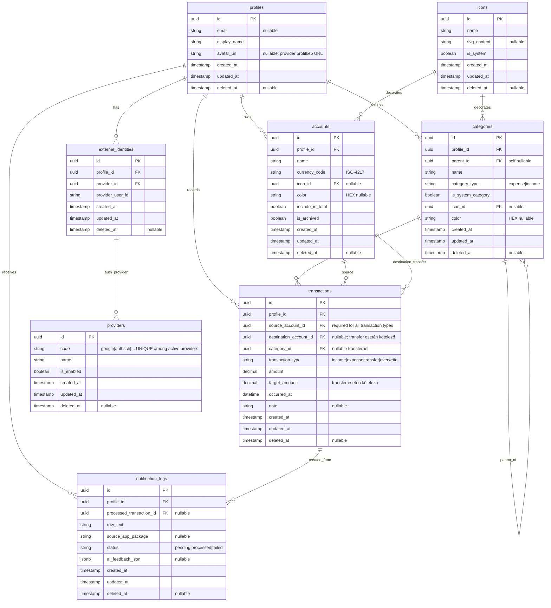

# Daily költségvetéskezelő – DB séma (v1.1)

## DB séma

## Szabályok

### Offline-first és szinkron
- Minden entitásban kötelező: `id`, `created_at`, `updated_at`, `deleted_at`.
- Konfliktus feloldás: azonos `id` esetén a nagyobb `updated_at` nyer.
- Soft delete: rekord törlése `deleted_at` beállítással történik.

### Összegkezelés
- Minden pénzösszeg 4 tizedes pontossággal tárolódik.
- `amount` mindig a forrásszámla devizájában értendő.
- `target_amount` csak eltérő devizás átutaláskor kötelező.

### Tranzakciós integritás (CHECK constraint ajánlás)
- `transaction_type = 'expense'`: `destination_account_id IS NULL`, `category_id IS NOT NULL`.
- `transaction_type = 'income'`: `destination_account_id IS NULL`, `category_id IS NOT NULL`.
- `transaction_type = 'transfer'`: `destination_account_id IS NOT NULL`, `category_id IS NULL`, `destination_account_id <> source_account_id`.
- `transaction_type = 'overwrite'`: automatikusan generált kezdőegyenleg tranzakció.
- `target_amount` csak `transfer` tranzakciónál engedélyezett, ott kötelező.
- `amount`, `target_amount` pozitív értékek lehetnek.

### Számla és kategória szabályok
- `accounts.currency_code` ISO-4217 kód (pl. `HUF`, `EUR`).
- `accounts.is_archived = true` esetén új tranzakció ne jöhessen létre rá.
- Kategóriafa: `parent_id` nem mutathat önmagára vagy saját leszármazottra.
- Törlés előtt a tranzakcióval rendelkező kategória átmozgatandó a rendszer `Other` kategóriába.

### Auth modell
- `external_identities` egyértelmű kapcsolat a lokális profil és provider-fiók között.
- Soft delete mellett javasolt egyediség: partial unique index `UNIQUE(provider_id, provider_user_id) WHERE deleted_at IS NULL`.
- `providers.code` stabil, környezetfüggetlen azonosito (`google`, `authsch`, ...), erre erdemes hivatkozni app oldalon.
- Provider `client_id`/`client_secret` ne keruljon ebbe a tablaba, maradjon `.env` konfiguracioban.

### Notification parser támogatás
- Nem biztosan feldolgozható értesítés: `notification_logs.status = 'pending'`.
- Sikeres feldolgozás esetén kapcsolás: `processed_transaction_id`.
- Felhasználói javítás/tanítás tárolása: `ai_feedback_json` (`JSONB`, PostgreSQL JSON operatorokhoz).

## Indexek

### Alap indexek (mindenképp)

- `profiles(updated_at)`
- `accounts(profile_id, is_archived, deleted_at)`
- `categories(profile_id, parent_id, deleted_at)`
- `transactions(profile_id, occurred_at, deleted_at)`
- `transactions(source_account_id, occurred_at)`
- `transactions(destination_account_id, occurred_at)`
- `external_identities(provider_id, provider_user_id)` UNIQUE partial: `WHERE deleted_at IS NULL`
- `notification_logs(profile_id, status, created_at)`

### Kiegészítő, projekt-specifikus indexek

- `profiles(email)` UNIQUE, partial: `WHERE email IS NOT NULL AND deleted_at IS NULL`
- `profiles(deleted_at)`
- `providers(deleted_at)`
- `providers(code)` UNIQUE partial: `WHERE deleted_at IS NULL`
- `external_identities(profile_id, deleted_at)`
- `external_identities(provider_id, deleted_at)`
- `icons(is_system, deleted_at)`
- `accounts(profile_id, include_in_total, deleted_at)`
- `accounts(profile_id, name)` UNIQUE, partial: `WHERE deleted_at IS NULL`
- `categories(profile_id, category_type, deleted_at)`
- `categories(profile_id, parent_id, name, category_type)` UNIQUE, partial: `WHERE deleted_at IS NULL`
- `transactions(profile_id, transaction_type, occurred_at, deleted_at)`
- `transactions(profile_id, category_id, occurred_at)`
- `transactions(profile_id, updated_at)`
- `notification_logs(profile_id, created_at)`
- `notification_logs(processed_transaction_id)`
- `notification_logs(ai_feedback_json)` GIN

### Technikai DB sémaszabályok

- `transactions.amount` és `transactions.target_amount`: `NUMERIC(18,4)`.
- Soft delete kompatibilis egyediség:
	- `profiles.email` egyedi csak aktív rekordokra (`WHERE email IS NOT NULL AND deleted_at IS NULL`).
	- `external_identities(provider_id, provider_user_id)` egyedi csak aktív rekordokra (`WHERE deleted_at IS NULL`).
	- `providers.code` egyedi csak aktív rekordokra (`WHERE deleted_at IS NULL`).
- Provider modell:
	- `providers.code` a stabil azonosító (`google`, `authsch`, ...).
	- `providers.is_enabled` mezővel szabályozható az adott provider ideiglenes tiltása.
	- OAuth titkok (`client_id`, `client_secret`) nem DB-ben tárolandók, hanem környezeti változókban.
- Adatminőség CHECK szabályok:
	- `accounts.currency_code` ISO-4217 formátum (`^[A-Z]{3}$`).
	- `accounts.color` és `categories.color` HEX formátum (`#RRGGBB`) vagy `NULL`.
	- Nem lehet üres: `profiles.display_name`, `accounts.name`, `categories.name`, `providers.name`, `external_identities.provider_user_id`, `notification_logs.raw_text`.
	- Pozitív pénzösszeg: `transactions.amount > 0`, `target_amount IS NULL OR target_amount > 0`.
- Referenciális viselkedés (hard delete esetére):
	- Profil törlése esetén függő rekordok `CASCADE`.
	- Opcionális kapcsolatoknál (`icon_id`, `category_id`, `destination_account_id`, `processed_transaction_id`, `parent_id`) `SET NULL`.
	- Kritikus hivatkozásoknál (pl. `transactions.source_account_id`, `external_identities.provider_id`) `RESTRICT`.

### Megjegyzések

- A `deleted_at`-os mezők indexelése fontos soft-delete mellett, mert tipikusan `deleted_at IS NULL` feltétellel kérdezünk.
- A partial UNIQUE indexek lehetővé teszik az azonos értéket archivált/törölt rekordokban, miközben az aktív adatoknál megmarad az egyediség.
- A tranzakciós indexek célja a leggyakoribb listázások gyorsítása: időrend, típus szerinti szűrés, kategória szerinti riport, transfer párosítás.