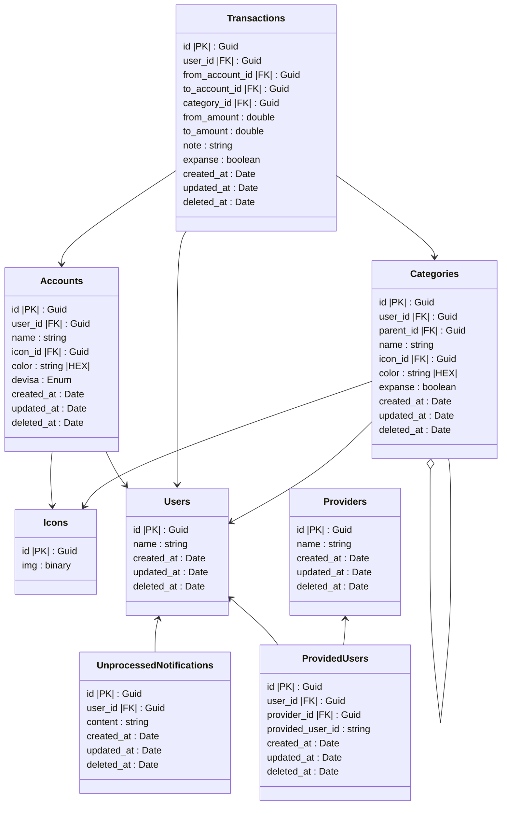

# Költségvetéskezelő alkalmazás - DB terve

## Magyarázat:

**Accounts:**

- devisa property egy Enum értékei közül választandó ki (pl: EUR, HUF, ...), ezek csak jelzés értékűek a számlák közti fizetés esetére

**Transactions:**
- **Kiadás**: `from_acccount_id` (lehet null) ki van töltve, a `to_account_id` pedig null
- **Bevétel:** `to_account_id` (lehet null) ki van töltve, a `from_account_id` pedig null
- **Számlák közti utalás** esetén a `from_account_id` ahonnan utalja, `to_account_id` ahova utalja. Eltérő devizák esetén a `from_amount` és a `to_amount` mező is kitöltendő, hogy mennyi vonódik le, és hogy váltandó a deviza (átváltás)
- `expanse`: Igaz ha kiadás, Hamis ha bevétel

**Categoreis:**
- `expanse`: Igaz ha kiadás, Hamis ha bevételi kategória
- `parent_id`: A szülő kategória id-je, hogy lehessen al-kategóriákat lérehozni (fa struktúra)

**Icons:**
- `img`: Az ikon (svg) binárisa, hogy ne kelljen külön fájlba tárolni

**Users:**
- Lokális felhasználói az alkalmazásnak, amik a providerektől függetlenül is tudnak kapcsolatot szolgáltatni az adatbázis többi részének

**ProvidedUsers**
- Privder által létrehozott kapcsoló az external bejelentkező és a lokális felhasználói bejegyzés között
  - Ha csak lokál user van, akkor nincs kitöltve ebben sor, csak ha azt csatlakoztatja majd a felhasználó egy external provider-hez.
- `provided_user_id`: Az external provider által adott egyedi azonsosítója a felhasználónak

**Providers**
- External bejelentkezés támogató alkalmazások (pl authSch, google)

**UnprocessedNotifications:**
- Ebben fogja Queue-olni az AI-al még fel nem dolgozott tranzakciókat amiket a push notification-ből kiolvas
- `created_at`: amikor megkapta a push notit
- `updated_at`: Ha AI-al feldolgozta a notit, akkor ez a mező beíródik, és törölhető X idő múlva
- `deleted_at`: TBD

**Miért kell mindenhova a created_at, updated_at, deleted_at?**
- Hogy a lokális db a serveren futó db-fel tudjon synchelni, és tudja mindig mi van lemaradva.  
(Pl Ha nincs net, és lokálisan változtatok valamit, akkor az updated_at megávltozik, és ha lesz internet a szerver innen tudja majd, hogy az le van maradvan a változtatásokkal.)