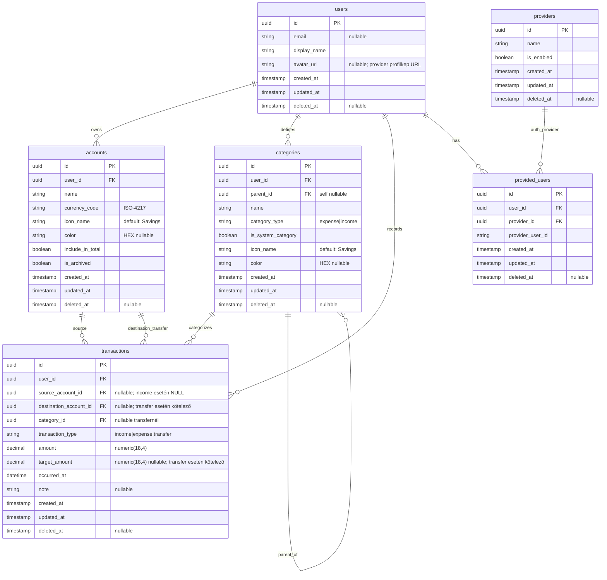

# Daily költségvetéskezelő – DB séma (v2.0)

## DB séma

## Szabályok

### Offline-first és szinkron
- Minden entitásban kötelező: `id`, `created_at`, `updated_at`, `deleted_at`.
- Konfliktus feloldás: azonos `id` esetén a nagyobb `updated_at` nyer.
- Soft delete: rekord törlése `deleted_at` beállítással történik.

### Összegkezelés
- Minden pénzösszeg 4 tizedes pontossággal tárolódik.
- `amount` mindig a forrásszámla devizájában értendő.
- `target_amount` a jelenlegi modellben minden `transfer` tranzakciónál kötelező.

### Tranzakciós integritás (jelenleg implementált CHECK constraint)
- `transaction_type = 'income'`: `destination_account_id IS NOT NULL`, `source_account_id IS NULL`, `category_id IS NOT NULL`.
- `transaction_type = 'expense'`: `source_account_id IS NOT NULL`, `destination_account_id IS NULL`, `category_id IS NOT NULL`.
- `transaction_type = 'transfer'`: `source_account_id IS NOT NULL`, `destination_account_id IS NOT NULL`, `source_account_id <> destination_account_id`, `category_id IS NULL`, `target_amount IS NOT NULL`.
- `transaction_type = 'overwrite'` szerepel a típusellenőrzésben, de a jelenlegi összetett integritási szabály nem definiál hozzá érvényes rekordalakot.
- `amount > 0` kötelező.
- `target_amount` mezőre külön pozitivitási CHECK jelenleg nincs, csak a `transfer` esethez kapcsolt kötelezőség.

### Számla és kategória szabályok
- `accounts.currency_code` ISO-4217 kód (pl. `HUF`, `EUR`).
- `accounts.is_archived = true` esetén új tranzakció ne jöhessen létre rá.
- Kategóriafa: a jelenlegi séma csak azt garantálja, hogy `parent_id <> id`; saját leszármazottra mutatás ellen nincs DB-szintű védelem.
- Az ikonkapcsolat jelenleg denormalizált `icon_name` mezővel van tárolva mind `accounts`, mind `categories` táblában.

### Auth modell
- `provided_users` biztosítja a kapcsolatot a lokális profil és provider-fiók között.
- Soft delete mellett implementált egyediség: partial unique index `UNIQUE(provider_id, provider_user_id) WHERE deleted_at IS NULL`.
- A `providers` táblában jelenleg nincs külön `code` mező, csak `name` és `is_enabled`.
- Provider `client_id`/`client_secret` továbbra sem DB-ben tárolandó.

### Jelenleg nem aktív táblák
- Az `icons` és `notification_logs` modellek a kódban kommentelve vannak, így a refaktorált aktuális sémának nem részei.

## Indexek

### Alap indexek (mindenképp)

- `users(updated_at)`
- `users(deleted_at)`
- `providers(deleted_at)`
- `provided_users(provider_id, provider_user_id)` UNIQUE partial: `WHERE deleted_at IS NULL`
- `provided_users(user_id, deleted_at)`
- `provided_users(provider_id, deleted_at)`
- `accounts(user_id, is_archived, deleted_at)`
- `accounts(user_id, include_in_total, deleted_at)`
- `categories(user_id, parent_id, deleted_at)`
- `categories(user_id, category_type, deleted_at)`
- `transactions(user_id, occurred_at, deleted_at)`
- `transactions(source_account_id, occurred_at)`
- `transactions(destination_account_id, occurred_at)`
- `transactions(user_id, transaction_type, occurred_at, deleted_at)`

### Kiegészítő, projekt-specifikus indexek

- `users(email)` UNIQUE, partial: `WHERE email IS NOT NULL AND deleted_at IS NULL`
- `providers(name)` UNIQUE, partial: `WHERE deleted_at IS NULL`
- `provided_users(provider_id, provider_user_id)` UNIQUE, partial: `WHERE deleted_at IS NULL`
- `provided_users(user_id, deleted_at)`
- `provided_users(provider_id, deleted_at)`
- `accounts(user_id, include_in_total, deleted_at)`
- `accounts(user_id, name)` UNIQUE, partial: `WHERE deleted_at IS NULL`
- `categories(user_id, category_type, deleted_at)`
- `categories(user_id, parent_id, name, category_type)` UNIQUE, partial: `WHERE deleted_at IS NULL`
- `transactions(user_id, transaction_type, occurred_at, deleted_at)`
- Jelenleg nincs implementált index a `transactions(user_id, category_id, occurred_at)` vagy `transactions(user_id, updated_at)` kombinációkra.

### Technikai DB sémaszabályok

- `transactions.amount` és `transactions.target_amount`: `NUMERIC(18,4)`.
- Soft delete kompatibilis egyediség:
	- `users.email` egyedi csak aktív rekordokra (`WHERE email IS NOT NULL AND deleted_at IS NULL`).
    - `provided_users(provider_id, provider_user_id)` egyedi csak aktív rekordokra (`WHERE deleted_at IS NULL`).
    - `providers.name` egyedi csak aktív rekordokra (`WHERE deleted_at IS NULL`).
- Provider modell:
	- `providers.is_enabled` mezővel szabályozható az adott provider ideiglenes tiltása.
    - Jelenleg a provider azonosítására dokumentációs szinten a `name` mező áll rendelkezésre.
    - OAuth titkok (`client_id`, `client_secret`) nem DB-ben tárolandók, hanem környezeti változókban.
- Adatminőség CHECK szabályok:
	- `accounts.currency_code` ISO-4217 formátum (`^[A-Z]{3}$`).
	- `accounts.color` és `categories.color` HEX formátum (`#RRGGBB`) vagy `NULL`.
    - Nem lehet üres: `users.display_name`, `accounts.name`, `categories.name`, `providers.name`, `provided_users.provider_user_id`.
    - Pozitív pénzösszeg: `transactions.amount > 0`.
- Referenciális viselkedés (hard delete esetére):
	- Profil törlése esetén függő rekordok `CASCADE`.
    - Opcionális kapcsolatoknál (`category_id`, `destination_account_id`, `parent_id`) `SET NULL`.
    - Kritikus hivatkozásoknál (pl. `transactions.source_account_id`, `provided_users.provider_id`) `RESTRICT`.

### Megjegyzések

- A `deleted_at`-os mezők indexelése fontos soft-delete mellett, mert tipikusan `deleted_at IS NULL` feltétellel kérdezünk.
- A partial UNIQUE indexek lehetővé teszik az azonos értéket archivált/törölt rekordokban, miközben az aktív adatoknál megmarad az egyediség.
- Az `Accounts.balance` oszlop a modellben számított `column_property`, nem fizikai adatbázis-oszlop.
- A tranzakciós indexek célja a leggyakoribb listázások gyorsítása: időrend, típus szerinti szűrés és számlaoldali lekérdezések.