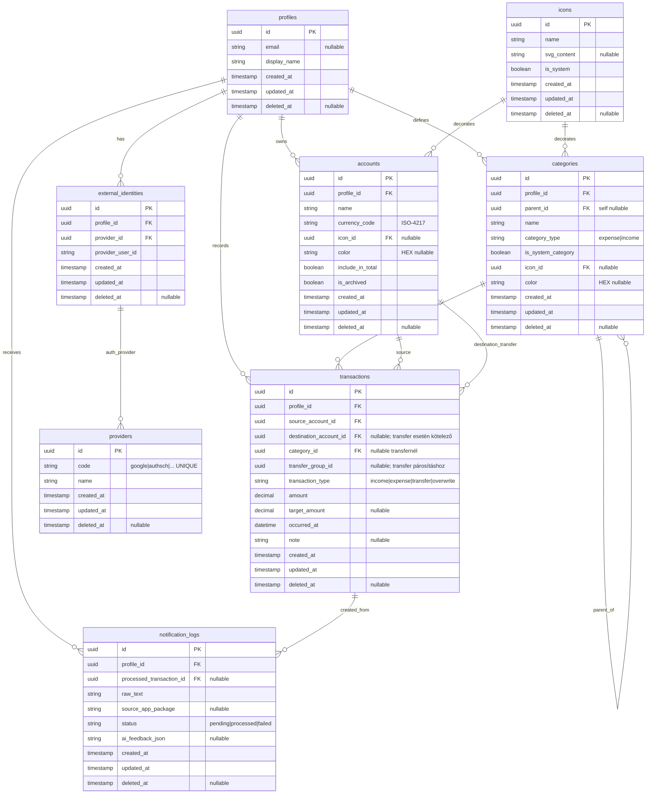

# Daily költségvetéskezelő – DB séma (v1.1)

## DB séma

## Szabályok

### Offline-first és szinkron
- Minden entitásban kötelező: `id`, `created_at`, `updated_at`, `deleted_at`.
- Konfliktus feloldás: azonos `id` esetén a nagyobb `updated_at` nyer.
- Soft delete: rekord törlése `deleted_at` beállítással történik.

### Összegkezelés
- Minden pénzösszeg 2 tizedes pontossággal tárolódik.
- `amount` mindig a forrásszámla devizájában értendő.
- `target_amount` csak eltérő devizás átutaláskor kötelező.

### Tranzakciós integritás (CHECK constraint ajánlás)
- `transaction_type = 'expense'`: `destination_account_id IS NULL`, `category_id IS NOT NULL`.
- `transaction_type = 'income'`: `destination_account_id IS NULL`, `category_id IS NOT NULL`.
- `transaction_type = 'transfer'`: `destination_account_id IS NOT NULL`, `category_id IS NULL`.
- `transaction_type = 'overwrite'`: automatikusan generált kezdőegyenleg tranzakció.

### Számla és kategória szabályok
- `accounts.currency_code` ISO-4217 kód (pl. `HUF`, `EUR`).
- `accounts.is_archived = true` esetén új tranzakció ne jöhessen létre rá.
- Kategóriafa: `parent_id` nem mutathat önmagára vagy saját leszármazottra.
- Törlés előtt a tranzakcióval rendelkező kategória átmozgatandó a rendszer `Other` kategóriába.

### Auth modell
- `external_identities` egyértelmű kapcsolat a lokális profil és provider-fiók között.
- Javasolt egyediség: `UNIQUE(provider_id, provider_user_id)`.

### Notification parser támogatás
- Nem biztosan feldolgozható értesítés: `notification_logs.status = 'pending'`.
- Sikeres feldolgozás esetén kapcsolás: `processed_transaction_id`.
- Felhasználói javítás/tanítás tárolása: `ai_feedback_json`.

## Indexek

- `profiles(updated_at)`
- `accounts(profile_id, is_archived, deleted_at)`
- `categories(profile_id, parent_id, deleted_at)`
- `transactions(profile_id, occurred_at, deleted_at)`
- `transactions(source_account_id, occurred_at)`
- `transactions(destination_account_id, occurred_at)`
- `external_identities(provider_id, provider_user_id)` UNIQUE
- `notification_logs(profile_id, status, created_at)`