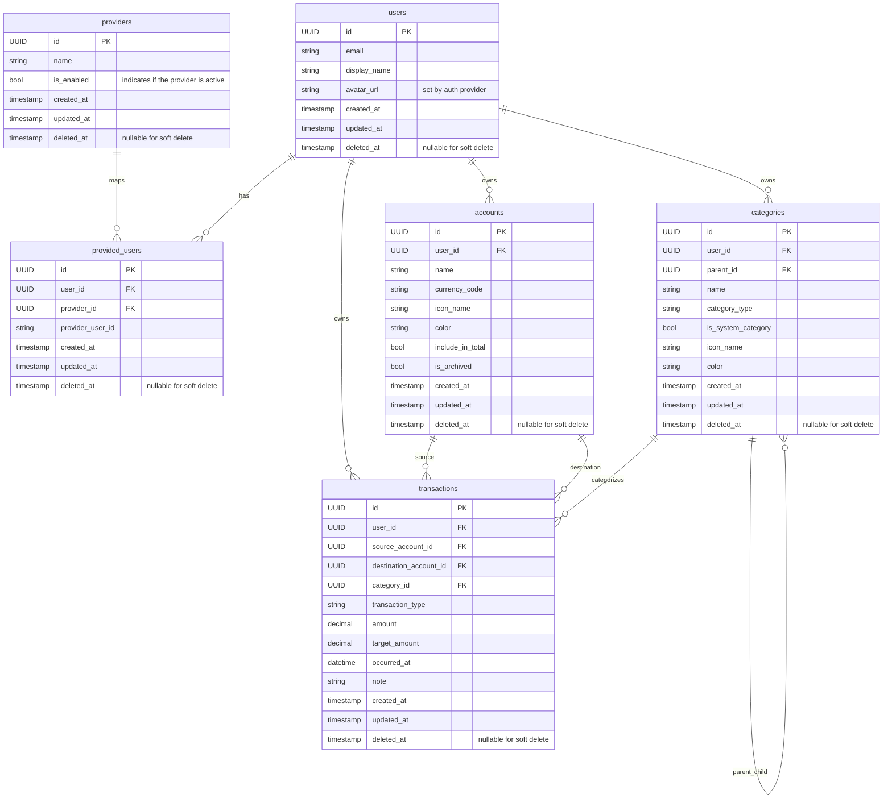

# Database Schema

Last updated: 2026-05-04

## ER Diagram

## Rules

Core rules implemented in DB constraints and model definitions:
- soft delete on core entities (`deleted_at`)
- transaction type integrity rules
- positive amount check
- ISO-4217-like currency code check
- HEX color check

## Transaction Integrity

- income: destination account required, source null, category required
- expense: source account required, destination null, category required
- transfer: source and destination required and different, category null, target_amount required

## Notes

- `accounts.balance` is computed from transaction rows, not stored as a static value
- `transaction_type` DB check includes `overwrite`, but app logic currently uses expense/income/transfer (for future feature)
